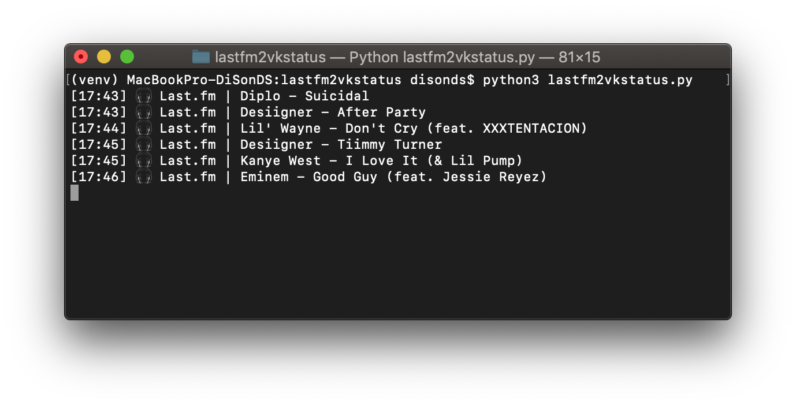

# lastfm2vkstatus

Use currently playing track as status in VK.com

## Requirements
-   pylast
-   vk_api

## Setup

### Last.fm
1.  Obtain your api_key, api_secret from <https://www.last.fm/api/account/create>
2.  Complete the **settings.py** with last.fm api_key, api_secret, username, password

### VK.com
1.  Obtain your access token: <https://vk.cc/8Abj47>
2.  Complete the **settings.py** with token

## Usage

```console
python3 lastfm2vkstatus.py
```

